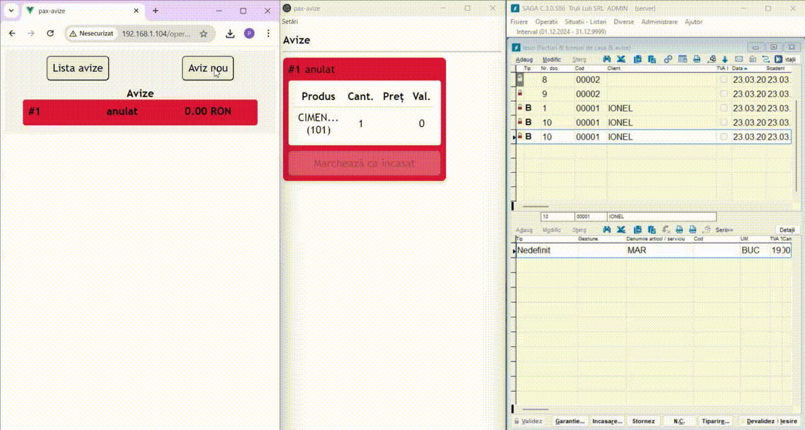

[](README.md)

# pax-avize

This app allows store operators to create a product list (an order, ro: "aviz") for clients shopping in their store, and sending it to the
cashier once it is ready. The cashier can then easily drag-and-drop the order into the financial software [SAGA C](https://www.sagasoft.ro/saga-c.php),
which is the software managing the cash register. (you are welcome to integrate this with your own financial software)
Check out the animation below of how it works. There are three windows in the animation: on the left is the operator view, that would typically be displayed on a mobile phone. In the middle is the cashier view, from where orders may be dragged into the window on the right, which is the  SAGA C software.


The motivation for developing this app was to efficientize the cash-in process in a hardware-store, where
these orders used to be written on paper, and given to the cashier to input into SAGA C by hand. This was error-prone
and led to unnecessary waiting times. I would point out that the SAGA company does offer a cash-in software called [Market Line](https://www.sagasoft.ro/MarketLine.php), but it seems taylored to traditional shops, where all products can be easily brought to the cashier. The pax-avize software is taylored for shops where orders are managed by an operator, and are cashed in at the cashier, most likely by someone else.

## Components

The app has three components: a frontend for the operator, wher he inputs orders, a frontend for the cashier, which is actually
an `electron` app built from the same code as the operator frontend the two residing in the directory `frontend`.

In the folder `backend` resides a python server (implemented using `bottle`) which manages the incoming orders and also serves
data about the products.

## How to run this
For the web app, you can run a docker container as in the script [run_docker.sh](run_docker.sh). Note that this is using the data in the [app_data](app_data) folder, which contains a config.json file and an xls file with the available products.

To run the electron app, which allows you to drag-and-drop the incoming orders into the SAGA software, you can get the executable (windows, AppImage, snap) from the releases. Once it's running, you will have to point it to the backend, by entering the corresponding url address in the settings menu. You will have to then restart the app. If you are using the docker container, the url is `http://ip-of-pc-running-the-container/api`. 


## How to develop this
Check out the [README](frontend/README.md) in the frontend folder for instructions on how to run the web app, as well as the electron app, in dev mode.

To run the backend, make sure the [requirements.txt](backend/requirements.txt) are installed and run, for instance

```
cd backend
EPAPER_DATA=../app_data EPAPER_HOST=0.0.0.0 EPAPER_PORT=8082
```