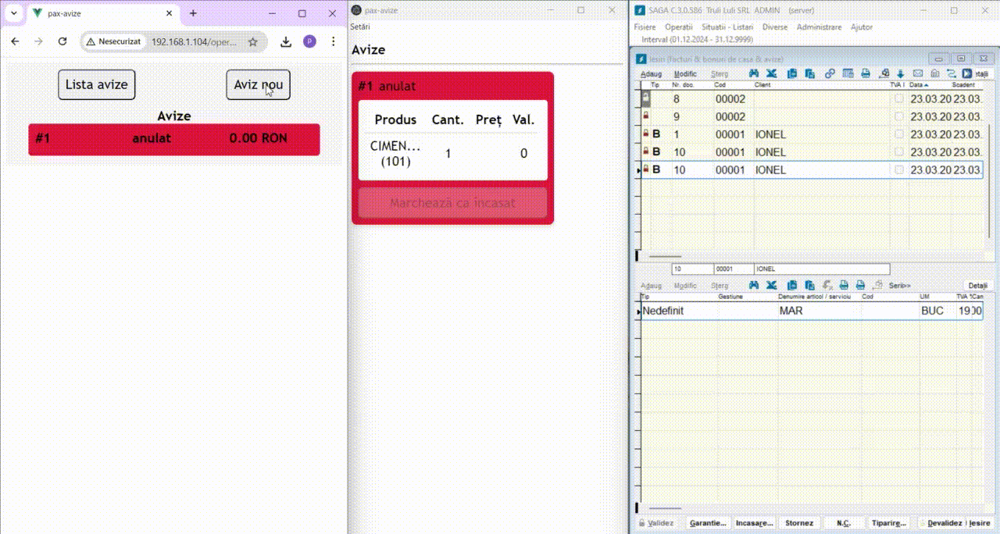

# pax-avize

Această aplicație permite gestionarilor din magazine să creeze o listă de produse (un *aviz*) pentru clienții care fac cumpărături în magazinul lor, și să o trimită casierului
odată ce este gata de încasat. Casierul poate apoi să introducă cu ușuriță avizul, sub forma unei intrări, în software-ul financiar [SAGA C](https://www.sagasoft.ro/saga-c.php) printr-un drag-and-drop cu mouse-ul,
(sunteți invitați să integrați acest sistem în propriul software financiar, sau să mă contactați dacă sunteți interesați de o astfel de integrare)
Consultați animația de mai jos pentru a vedea software-ul în acțiune. Există trei ferestre în animație: în stânga este ecranul gestionarului, care ar fi afișată de obicei pe un telefon mobil. În mijloc este aplicația folosită de către casier, de unde comenzile pot fi trase în fereastra din dreapta, care este software-ul SAGA C.


Motivația pentru dezvoltarea acestei aplicații a fost eficientizarea procesului de încasare într-un magazin de materiale de construcții și bricolaj, unde
aceste comenzi erau scrise pe hârtie și date casierului pentru a fi introduse manual în SAGA C. Această procedură era generatoare de erori
și ducea la timpi de așteptare inutili. Aș dori să subliniez faptul că societatea SAGA oferă un software de încasare numit [Market Line] (https://www.sagasoft.ro/MarketLine.php), dar acesta pare adaptat magazinelor tradiționale, unde toate produsele pot fi aduse cu ușurință la casierie. Software-ul pax-avize este destinat magazinelor în care clientul este servit de către un gestionar, cu marfă pe care poate o încarcă direct în mașină, și sunt încasate în prealabil la casierie, cel mai probabil de către un casier dedicat, dar poate și de către același gestionar.

## Componente

Aplicația are trei componente: o pagină web pentru operator (gândită pentru folosirea pe smartphone), unde acesta introduce comenzile, o aplicație desktop pentru casier, cele două aflându-se în directorul `frontend`.

În folderul `backend` se află un server python (implementat folosind `bottle`) care gestionează comenzile primite și, de asemenea, servește date despre produse.

## Cum să executați această aplicație
Pentru aplicația web, puteți executa un container docker ca în scriptul [run_docker.sh](run_docker.sh). Luați aminte că aceasta utilizează datele din folderul [app_data](app_data), care conține un fișier `config.json` cu configurația programului (date legate de generarea informatiilor pt. SAGA) și un fișier `produse.xls` cu produsele disponibile, care poate fi obținut prin export `xls` din ecranul "Articole" al programului SAGA.

Pentru a rula aplicația electronică, care vă permite să trageți avizele primite în software-ul SAGA, puteți obține executabilul (*windows*, AppImage, snap) de la pagina de [release-uri](https://github.com/ianosd/pax-avize/releases). Odată ce se execută, va trebui să setați url-ul backend-ului, introducând adresa url corespunzătoare în meniul de setări. Va trebui apoi să reporniți aplicația. Dacă utilizați containerul docker, adresa URL este `http://<ip-ul calculatorului unde rulează containerul>/api`. 


## Cum să dezvoltați această aplicație
Consultați [README](frontend/README.md) din folderul frontend pentru instrucțiuni despre cum să executați aplicația web, precum și aplicația electronică, în modul dev.

Pentru a rula backend-ul, asigurați-vă că [requirements.txt](backend/requirements.txt) sunt instalate și rulați, de exemplu

```
cd backend
EPAPER_DATA=../app_data EPAPER_HOST=0.0.0.0 EPAPER_PORT=8082
```